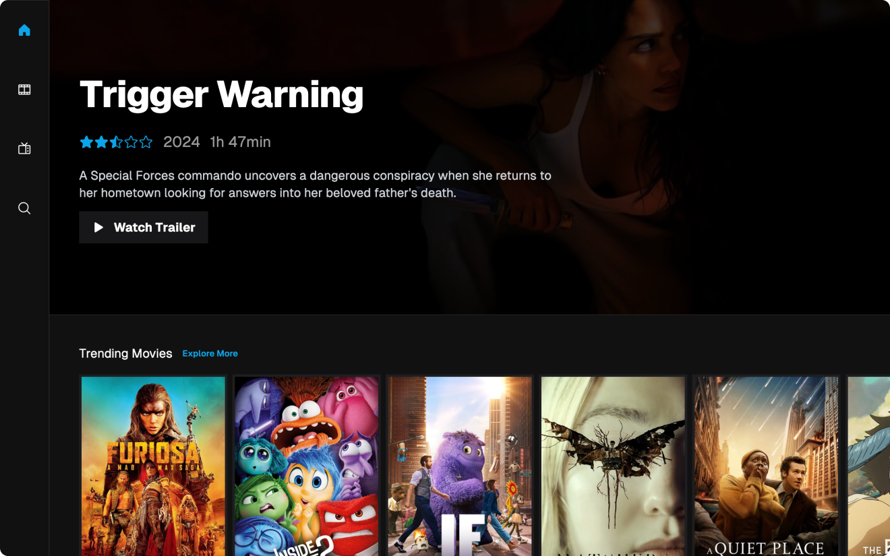
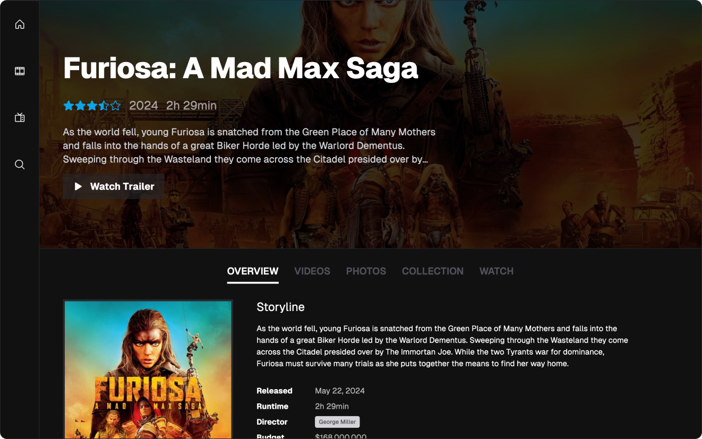
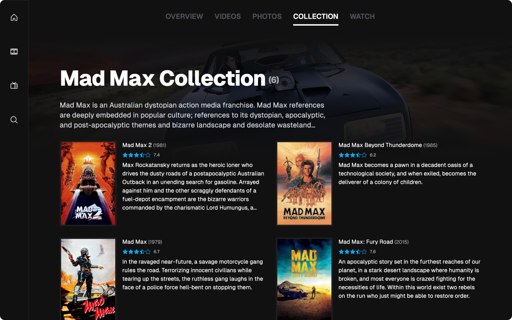
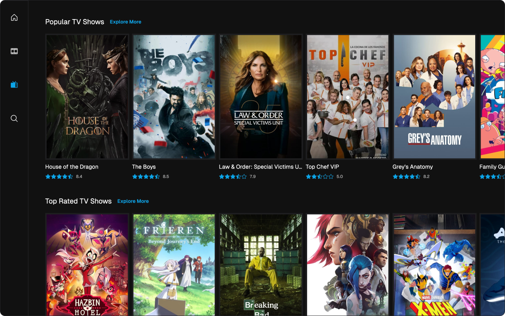
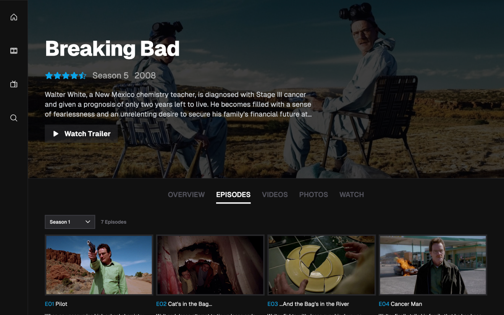

# movies

Movies is a web app powered by [The Movie Database API](https://developers.themoviedb.org/3) that allows users to search for movies, view movie details, and watch trailers. The app is build with [Next.js](https://nextjs.org/) and [Tailwind CSS](https://tailwindcss.com/). The application offers a responsive design and is optimized for mobile, tablet, and desktop devices. Also includes pages of popular movies, top-rated movies, upcoming movies, and now playing movies etc. The app also includes a search feature that allows users to search for movies, tv shows or people by title.


## Screenshots






## Features

- Search for movies, tv shows or people by title
- View popular movies, top-rated movies, upcoming movies, and now playing movies
- View movie, tv show, person details
- Watch movie, tv show trailers/videos
- View similar movies, tv shows
- View movie, tv show images
- View provider information
- Responsive design optimized for mobile, tablet, and desktop devices

## Routes

The app uses dynamic routes to display different content based on the URL. The following is a list of routes and their details:

| Route                           | Details                                       |
| ------------------------------- | --------------------------------------------- |
| app/page.tsx                    | Homepage: Trending movies, tv shows           |
| app/:type                       | Movie/TV Show                                 |
| app/:type/:query                | Popular, Top Rated, Upcoming, Airing Today... |
| app/:type/detail/:id            | Detail page of Movie/TV Show                  |
| app/:type/detail/:id/collection | Collection page of Movie                      |
| app/:type/detail/:id/episodes   | Episodes page of TV Show                      |
| app/:type/detail/:id/photos     | Photos of Movie/TV Show                       |
| app/:type/detail/:id/videos     | Videos of Movie/TV Show                       |
| app/:type/detail/:id/watch      | Providers for Movie/TV Show                   |
| app/:type/genre/:id             | Movie/TV Show List  of Genre                  |
| app/:type/trending              | Trending Movies/TV Shows                      |
| app/person/detail/:id           | Detail page of Person                         |
| app/search                      | Search page                                   |

## Setup

1. Take a copy of `.env.example` and re-name to `.env.local`
2. Get your [TMDB](https://developers.themoviedb.org/3) API key
3. Enter the details into the `.env.local` file
4. Start the dev server with the following scripts

<br />

```bash
# Install dependencies
$ npm install

# Start dev server with hot reload at localhost:3000
$ npm run dev
```

Open [http://localhost:3000](http://localhost:3000) with your browser to see the result.

You can start editing the page by modifying `app/page.tsx`. The page auto-updates as you edit the file.

## Deployment

The app is deployed with [Vercel](https://vercel.com/). The deployment is done automatically when changes are pushed to the `main` branch.

## Contributing

Contributions are welcome! Feel free to open an issue or submit a pull request if you have any ideas or features you would like to add.

Please make sure your pull request is in line with the repository's code style.

## Credits

Based on [hjasonujmaalvis/vue-movies/](https://github.com/jasonujmaalvis/vue-movies/)


Data provided by [The Movie Database](https://www.themoviedb.org).

This project uses the TMDB API but is not endorsed or certified by TMDB.
